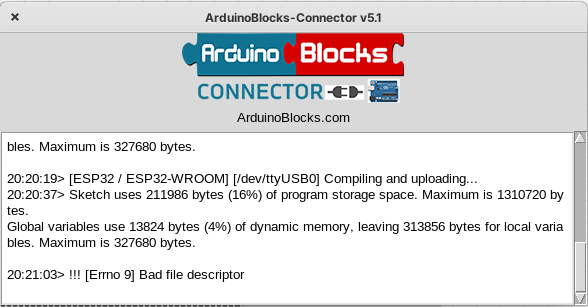

# Instalación de ArduinoBlocks

Comenzaremos usando [ArduinoBlocks.com](http://www.arduinoblocks.com): una herramienta de programación con bloques ideal para iniciarse.

Instalamos [ArduinoBlock Connector](http://www.arduinoblocks.com/web/site/abconnector5)

[Creamos nuestra cuenta](http://www.arduinoblocks.com/web/site/register)

