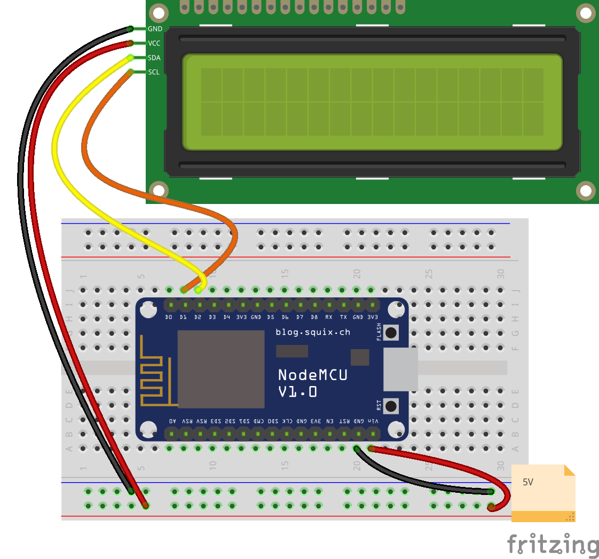

## LCD

Vamos a conectar ahora una pantalla LCD de conexión I2C (protocolo de tipo bus que nos permite conectar varios dispositivos a alta velocidad usando los mismos pines: SDA y SCL)

1. Instalamos la librería LCD I2C
1. Características: filas y columnas, iluminación, caracteres
1. Conectar LCD, 
* Para alimentación, algunos LCD necesitan 5V y para ellos los conectamos a 5V
* Conectamos los pines SDA y SCL de la placa y del LCD
1. Cada fabricante utiliza diferentes direcciones para sus LCDs, si no sabemos la nuestra podemos utilizar el programa ([I2C_scanner](https://github.com/javacasm/CursoIOTCo/blob/main/codigo/3.4.0.Scanner_I2C/3.4.0.Scanner_I2C.ino)). Normalmente son 0x27, 0x30 o 0x3F
1. Ejemplos:
  1. Hello LCD
  1. Contar/reloj TODO
  1. Estructurar la información en pantalla



Vamos a usar un LCD conectado por el protocolo I2C. Los pines I2C por defecto son SDA = GPIO 21 y SCL = GPIO 22 

Si queremos usar otros pines podemos hacerlo inicializando la librería wire con ellos

```C++
Wire.begin(pinSDA, pinSCL);
```

[Ejemplo](https://github.com/javacasm/CursoIOTCo/blob/main/codigo/3.4.1.LCD_world/3.4.1.LCD_world.ino):

```C++
#include <LCD_I2C.h>

LCD_I2C lcd(0x3F); // Default address of most PCF8574 modules, change according

void setup()
{
    lcd.begin(); // If you are using more I2C devices using the Wire library use lcd.begin(false)
                 // this stop the library(LCD_I2C) from calling Wire.begin()
    lcd.backlight();

    lcd.setCursor(5, 0);
    lcd.print("Hello"); 
    lcd.setCursor(5, 1);
    lcd.print("World!");
}

void loop(){}

```

### Problemas con el LCD

* No se enciende la pantalla
  * Se ha caido el jumper de atrás
  * Están mal conectados los cables de Vcc y GND

* Se enciende la pantalla  pero no se ve nada: Se puede ajustar el contraste con el potenciómetro de atrás del LCD

* Sólo se ve una línea de cuadrados oscuros: cambiar la dirección de 0x27 a 0x30 o 0x3F

## Ejercicio

1. Scroll de texto

```C++
for(int i = 0; i < 16 ; i += 1){
  lcd.clear(); // borramos la pantalla
  lcd.setCursor(i,0);
  lcd.print("Adios!!!");
  delay(500);
}
```

2. Usar la medida de tiempo de Arduino para mostrar un reloj en el LCD (aunque no tiene hora real)
