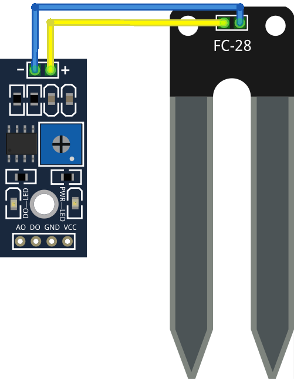

# Sensores analógicos

Los sensores digitales son aquellos que sólo pueden medir dos valores: 0 ó 1, encendido ó apagado, On ó Off, TRUE ó FALSE

Los sensores analógicos son aquells capaces de medir valor continuos, en un rango de posibles medidas, transformando el valor de una magnitud física en un medida eléctrica, en concreto en un voltaje
En el mundo Arduino (y en el nodeMCU) por sencillez esa medida se transforma en un valor entero entre 0 y 1023

Para medir las magnitudes conectaremos el dispositivo a medir a una de las patillas analógicas: A0 en el nodeMCU

# Tipos de sensores

Algunos sensores analógicos:
* Sensor de luz
* Sensor de humedad de suelo

# Montaje

A partir del ejemplo LCD con DHT (de Sensores atomosféricos) vamos a añadir primero un sensor de humedad

Y posteriormente un relé

