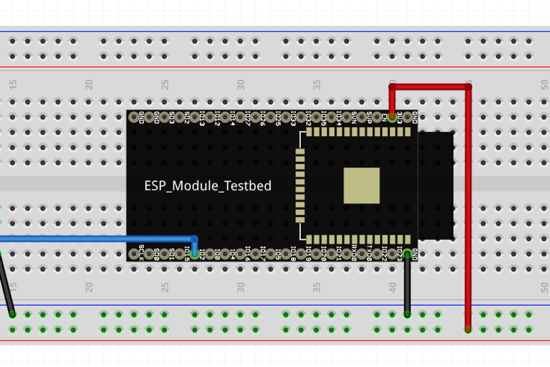
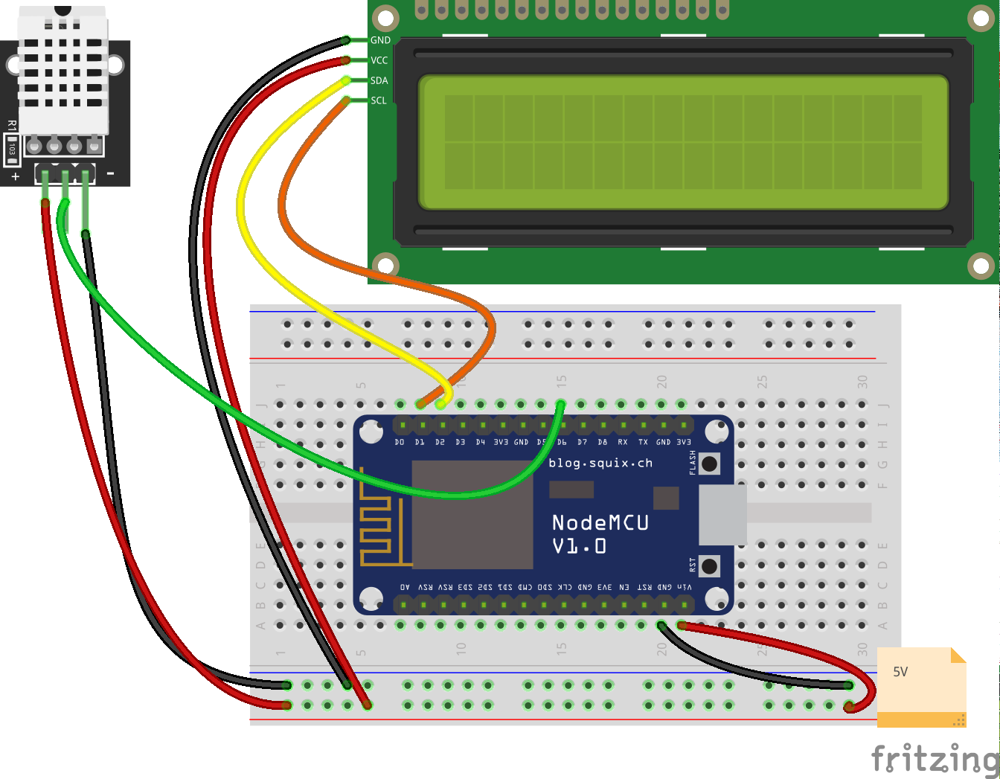
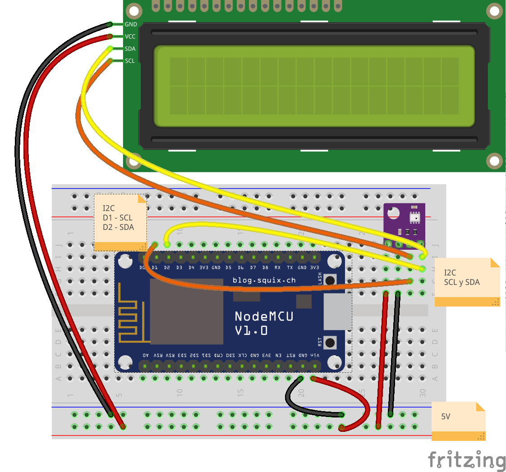

## Sensores atmosfericos

Son sensores capaces de medir los valores de las magnitudes atmosféricas, como la temperatura, humedad, presión, etc.

Veremos los distintos tipos y mostraremos los resultados por el monitor serie y en una pantalla LCD

Si no se ven los valores en el LCD puede ser por un error de conexión del sensor. Abriremos el monitor serie para ver si hay errores del sensor.


### TMP36



```
const int tempPin = 2;     //analog input pin constant<br>
int tempVal;    // temperature sensor raw readings
float volts;    // variable for storing voltage 
float temp;     // actual temperature variable
void setup()
{
  // start the serial port at 9600 baud
  Serial.begin(9600);
}
void loop()
{
 //read the temp sensor and store it in tempVal
 tempVal = analogRead(tempPin);
 volts = tempVal/1023.0;             // normalize by the maximum temperature raw reading range
 temp = (volts - 0.5) * 100 ;         //calculate temperature celsius from voltage as per the equation found on the sensor spec sheet.
Serial.print(" Temperature is:   "); // print out the following string to the serial monitor
Serial.print(temp);                  // in the same line print the temperature
Serial.println (" degrees C");       // still in the same line print degrees C, then go to next line.
delay(1000);                         // wait for 1 second or 1000 milliseconds before taking the next reading. 
}
```

### DHT

Es el sensor más barato y puede medir temperatura y humedad ambiental. Tiene una precisión de 1 grado.

Necesitamos un pin digital para cada sensor.




A partir del ejemplo LCD con DHT (de Sensores atomosféricos) vamos a añadir primero un sensor de humedad


Y posteriormente un relé


### BME280

Es un sensor más preciso (capaz de apreciar las décimas de grado) y que mide temperatura, humedad y presión atmosférica.

Se conectan usando el bus I2C  que comparte con otros dispositivos como el LCD o el reloj RTC



**Archivo -> Ejemplos -> Talleres Tecnología AILs ->3. Sensores II - Sensor Atmosferico BME280**
