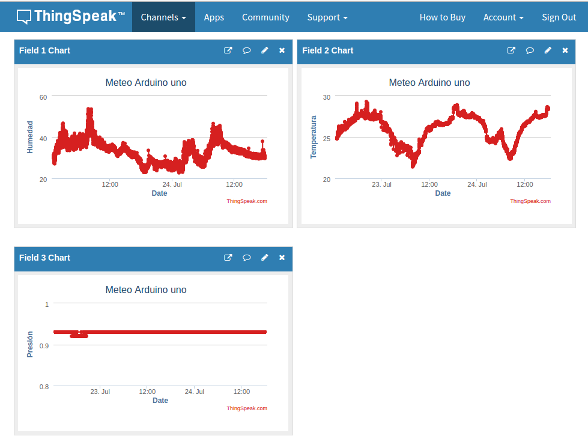

## Publicación de datos de IOT en servicios externos

Vamos a aprovechar nuestros conocimientos de python para trabajar en proyectos IOT.

Existen muchos servicios externos donde podemos publicar nuestros datos y representarlos gráficamente.

Estos servicios online, o en la nube como ahora se suele decir, exponen una serie de reglas para acceder a ellos.

Es lo que se conoce de forma genérica como un API (Application Programming Interface). 

Existen multitud de estos servicios, algunos nos permiten publicar contenidos en redes sociales (como Twitter y Facebook) otros nos facilitan el almacenar nuestros datos y mostrarlos como gráficas. Además estos servicios  dan una dimensión social a nuestros datos pudiendo compartirlos con otros usuarios.


### Plataformas de publicación de datos

La mayoría de estas plataformas nos permiten subir nuestros datos y obtener gráficas con ellos


Casi todas tienen una versión limitada (limitación en la frecuencia de envío de los datos o en el volumen de estos) gratuita y otra profesional de pago.

Además algunas nos permiten establecer disparadores (trigger) para vigilar que algún dato tome cierto valor, en cuyo caso envían un aviso a nuestro sistema.

* Adafruit IO https://io.adafruit.com/
* Blynk  https://blynk.io/
* Cayenne https://mydevices.com/ 
* Grafana https://grafana.com/
* Connect2me https://www.c2m.net
* All Things Talk https://www.allthingstalk.com/
* Thingspeak https://thingspeak.com/


## Publicación en ThingSpeak

ThingSpeak es una servicio web que nos permite publicar datos de las medidas de nuestros dispositivos IOT (o de cualquier otro).



Es gratuito para cierto número de datos y nos permite de manera muy sencilla subir datos.

### Creación del canal (Channel)

* Nos hacemos una cuenta en ThingSpeak, recibiremos un email y lo verificamos.

* Entramos en Channels->My Channels y pulsamos en "New Channel".


* Configuraremos el canal, indicando los datos que se van a enviar. Podemos añadir una descripción y datos como la web, canal de youtube, etc...


* Para poder enviar datos al canal necesitamos el API KEY que lo identifica que incluiremos en nuestro código.


* Para que cualquiera pueda ver los datos, podemos hacer que el canal sea público, desde la pestaña Sharing.


* Una vez creado el canal podemos configurar los detalles de cada gráfico, para lo que pulsaremos sobre el icono "lápiz" de cada uno.

* En cualquier momento podemos importar/exportar los datos de un gráfico dado.


### Código Arduino 

Éste es el código de ejemplo para Arduino ...

Instalamos la librería de thingSpeak


En el código cambiaremos las claves de thingspeak escritura y el código de nuestro canal:


```C++

```

[TODO: Código del ejemplo]()


Podremos ver el gráfico en su correspondiente canal


### Tutoriales para otras plataformas

La mayoría de las plataformas tienen tutoriales detallados, y muchas de ellas como por ejemplo Blynk incluso generan el código necesario para utilizarlas, con lo que nosotros sólo tenemos que personalizarlo con nuestro sensores y preferencias.

[Blynk](https://blynk.io/en/getting-started) [Instructable](https://www.instructables.com/id/Blynk-JavaScript-in-20-minutes-Raspberry-Pi-Edison/)

[Cayenne](https://www.instructables.com/id/Platform-IoT-Cayenne-Mydevices-ESP8266-12E-NodeMCU/) ([Librería mqtt](https://github.com/myDevicesIoT/Cayenne-MQTT-ESP))

[Grafana](https://www.spainlabs.com/foros/tema-SpainLabsIoT2018-Grafana-Dashboard-Open-Source)

Más adelante, cuando ya sepamos programar haremos otros ejemplos de publicación como por ejemplo vía Telegram.

