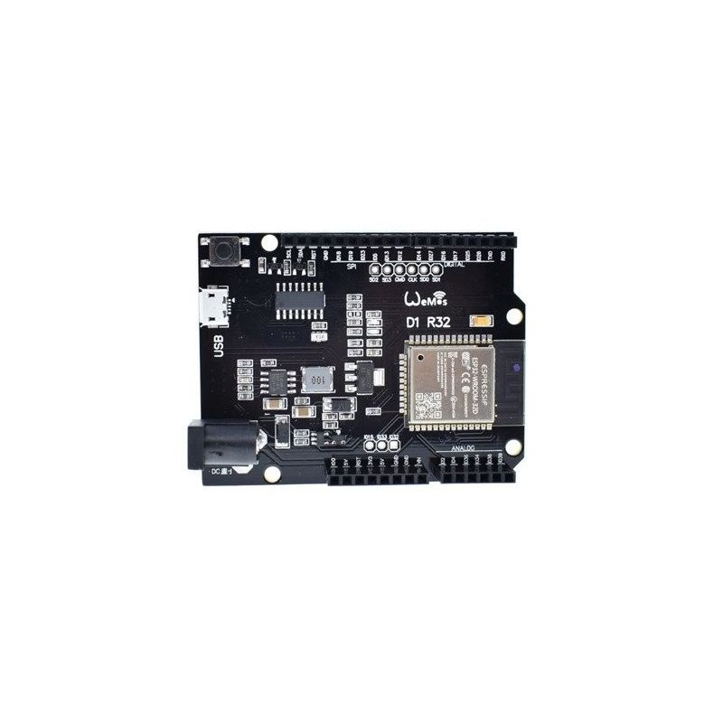
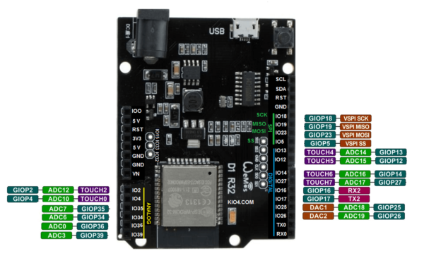
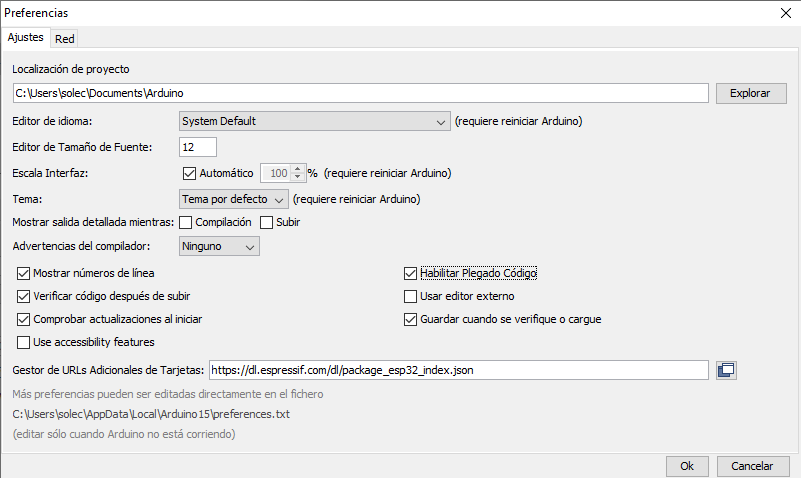
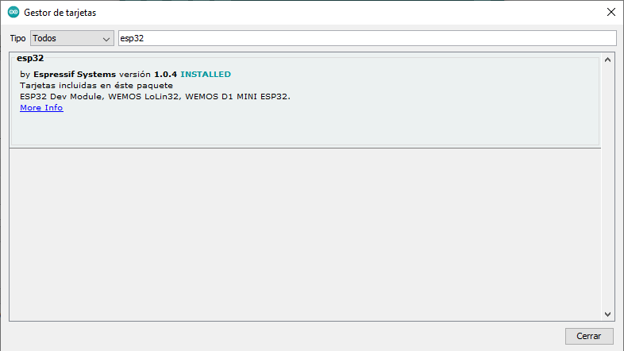

# Curso IOT 

## CEP de Córdoba

## Noviembre 2021


by @javacasm


### Arduino vs Wemos D1 R32


Cortesía de [Leopoldo Armesto Ángel](https://www.slideshare.net/LeopoldoArmestongel)


## Hardware



[Wemos D1 ESP32 R32 wroom](https://solectroshop.com/es/modulos-wifi/1755-wemos-d1-esp32-r32-wroom-32-wifi-y-bluetooth.html)


* Alimentación: 5-12VDC
* WiFi 802.11 b/g/n/e/i (802.11n hasta 150 Mbps)
* Bluetooth v4.2 BR/EDR y BLE.
* Compatible con shields de Arduino Uno.
* 6 Entrada analógica.
* 20 Entradas/Salidas digitales (3.3V) (con funciones PWM, interrupción).
* Comunicación UART, SPI, I2C.
* Tamaño: 68Ã--53 mm
* Conexión micro USB.
* 4Mb Flash Memoria 520Kb
* Reloj: 240Mhz (un núcleo dedicado al procesaro WiFi)
* Temperatura: -40C+85C
* Corriente: 250mA (max)
* Corriente en modo ahorro: 0.15mA
* Corriente de funcionamiento: 20mA (sin WiFi) 




## Programación

### Servo: D3 - GPIO25

Una aplicación del PWM es el control de los conocidos servos (o servomotores)

```python

import machine

servo = machine.PWM(machine.Pin(25),freq = 50)
servo.duty(47) # Posicion minima
servo.duty(82) # Posicion central
servo.duty(119) # Posicion maxima

```

### Motor L298n

[Ejemplo](https://github.com/GuyCarver/MicroPython/blob/master/lib/L298N.py)

```python
class motor(In1,In2,EN):
	def move(self,speed):
		if speed>0:
			In1.value(1)
			In2.value(0)
		elif speec < 0:
			In1.value(0)
			In2.value(1)
		else
			In1.value(0)
			In2.value(0)
		EN.duty(abs(speed))
```

## Configurar IDE de Arduino

1. Añadimos el repositorio de placas ESP32 en preferencias: "Archivo" -> "Preferencias" y añadimos esta URL (si ya hay ponemos una "," para separar) :

https://dl.espressif.com/dl/package_esp32_index.json



2. Añadimos las placas desde el menú "Herramientas" -> "Placas" -> "Gestor de tarjetas..." y buscamos "ESP32"



3. Pulsamos "Instalar"

4. Ahora tendremos nuevas placas disponibles. Seleccionaremos "ESP32 Dev Module" o "Do32..." según el fabricante

5. Si usamos SO Windows, tendremos que instalar los drivers para el chip CH340

6. También nos aparecerán nuevos ejemplos

## Recursos

[SDK de Espressif](https://github.com/espressif/arduino-esp32)


[Tutorial básico](https://solectroshop.com/es/content/125-tutorial-para-la-placa-wemos-d1-esp32-r32-wroom-32-wifi-y-bluetooth)